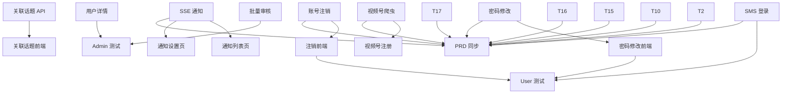

# Project: trendscope
# 目标: TrendScope PRD 全部差距补齐
# 创建: 2026-06-30

## 阶段说明

6 个阶段按优先级推进，阶段内任务可并行（无依赖关系），阶段间串行。
每个任务完成后自动 commit，达到阶段边界时推送到 GitHub。

## 任务清单

| # | 任务 | 依赖 | 风险 | PRD | 模式 | 验证标准 |
|---|------|------|------|-----|------|---------|
| 1 | SMS 验证码登录 — Redis 验证码生成/校验 + login_by_sms 实现 | - | low | yes | tdd | login_by_sms 返回 token，pytest 通过 |
| 2 | 邮箱注册验证 — 注册时邮箱验证码发送/校验 | - | low | yes | tdd | 邮箱注册需验证码，pytest 通过 |
| 3 | 密码修改 — PUT /user/password 端点 + Service 层 | - | low | yes | tdd | 密码修改成功/旧密码错误校验，pytest 通过 |
| 4 | 密码修改前端 — ProfilePage 添加密码修改表单 | 3 | low | yes | self-check | 表单可提交、密码规则校验、成功后 toast |
| 5 | 账号注销 — DELETE /user/account + 确认逻辑 | - | low | yes | tdd | 注销后无法登录，pytest 通过 |
| 6 | 账号注销前端 — ProfilePage 添加注销按钮+确认弹窗 | 5 | low | yes | self-check | 按钮可见、确认后跳转、token 清除 |
| 7 | SSE 通知推送端点 — 添加 StreamingResponse 实时推送 | - | low | yes | tdd | SSE 连接正常、心跳保持，pytest 通过 |
| 8 | 用户通知列表页 — 前端 /user/notifications 页面 | 7 | low | yes | self-check | 通知列表渲染、已读/未读状态、分页 |
| 9 | 通知设置页 — 通知偏好开关 UI | 7 | low | yes | self-check | 开关可切换、保存后持久化 |
| 10 | 热门文章浏览页 — 前端 /articles 列表页 | - | low | yes | self-check | 文章卡片渲染、分页、平台筛选 |
| 11 | 关联话题推荐 API — GET /trending/{id}/related 端点 | - | low | yes | tdd | 返回关联话题列表，pytest 通过 |
| 12 | 关联话题前端 — 单平台热榜页显示关联话题 | 11 | low | yes | self-check | 话题详情弹窗中显示关联推荐 |
| 13 | 视频号爬虫 — crawler-engine/spiders/weixin_channel.py | - | low | yes | tdd | fetch_trending_list 返回标准化 dict |
| 14 | 视频号注册 — __init__.py SPIDER_MAP + 平台种子数据 | 13 | low | yes | tdd | 平台列表含视频号、爬虫可按 code 获取 |
| 15 | 收藏夹管理 — 文件夹 CRUD API + 前端文件夹选择器 | - | low | yes | tdd | 创建/删除文件夹、收藏时选文件夹，pytest |
| 16 | 订阅通知触发 — 采集完成时扫描匹配的订阅并创建通知 | - | low | yes | tdd | 关键词匹配自动创建通知记录 |
| 17 | 采集实时状态 — GET /admin/crawl/status 端点 + 管理后台 UI | - | low | yes | tdd | 返回当前运行/等待/失败任务列表 |
| 18 | 批量审核 — POST /admin/articles/batch-audit 端点 + Vue UI | - | low | yes | tdd | 批量通过/驳回文章 |
| 19 | 用户详情统计 — GET /admin/users/{id}/stats + 管理后台 | - | low | yes | tdd | 返回收藏数/订阅数等，pytest |
| 20 | User 系统测试 — pytest 覆盖用户 API (login/register/profile) | 1,3,5 | low | no | tdd | 新测试 ≥10 条，全绿 |
| 21 | Admin 测试 — 覆盖管理后台 API | 18,19 | low | no | tdd | 新测试 ≥6 条，全绿 |
| 22 | PRD 同步 — 更新平台列表(13平台)、CHANGELOG、文档版本 | 1-21 | low | yes | self-check | PRD 平台列表与实际一致、CHANGELOG 完整 |

## DAG 依赖

## 执行策略
- 无依赖任务先执行（并行通过 subagent）
- 每个任务完成后 conventional commit + push
- 同类任务批量提交（如 1+2+3+5+7 可一起 commit）
- PRD 同步作为最后一道门禁
